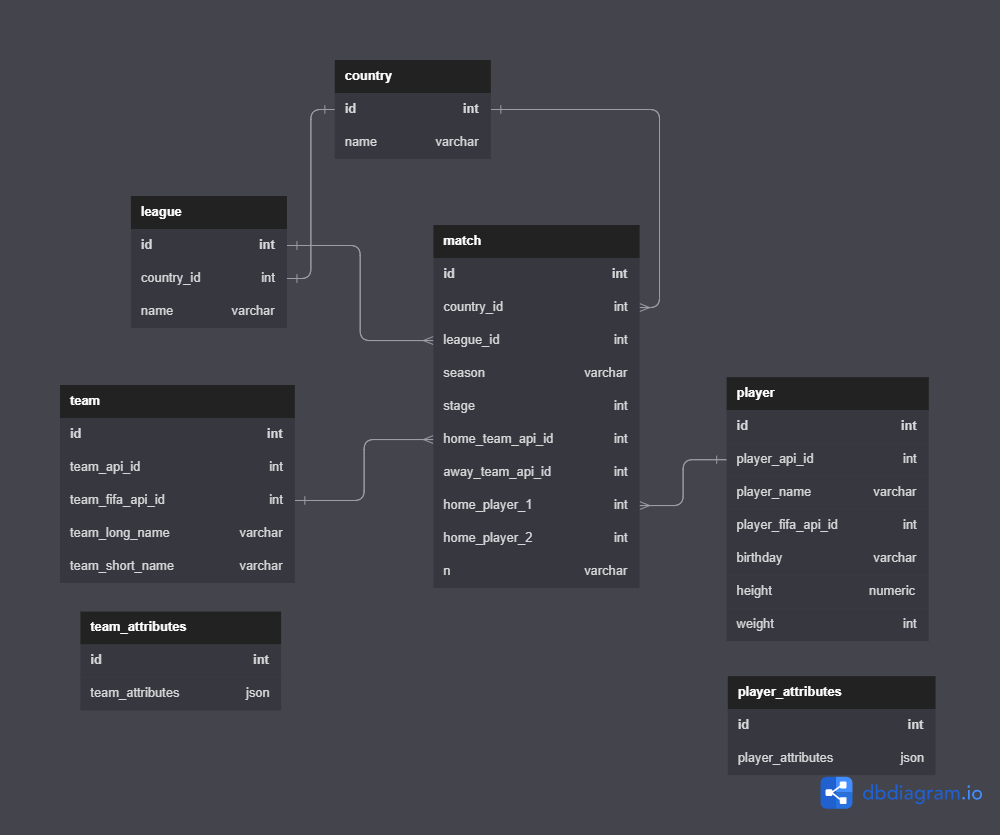
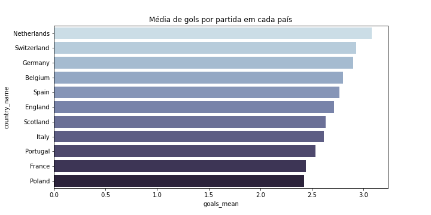
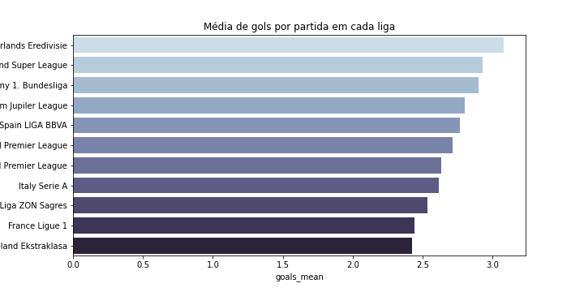
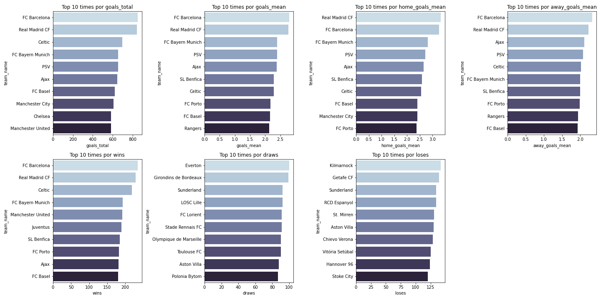
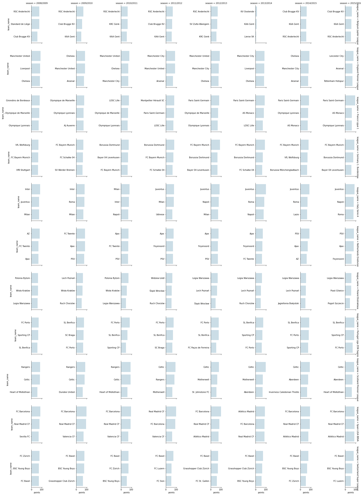
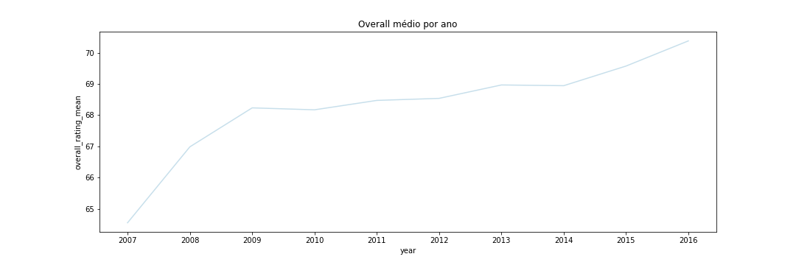
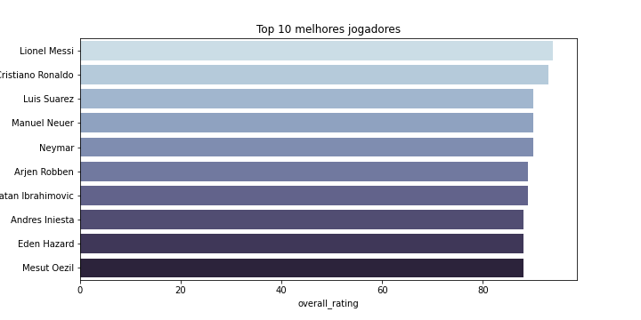

# Desafio - Analytics Engineer
Esta solução tem como objetivo avaliar e tratar os dados fornecidos para realização do desafio de Analytics Engineer da Clicksign. A solução passa por:
- Entendimento do problema proposto
- Carga dos datasets fornecidos
- Criação das tabelas modificadas
- Tratamento dos dados para garantir qualidade
- Realização de análise exploratória
- Identificar relação entre os dados de League, Country, Team_Attributes e Player
- Criação de query para automatizar relatório
- Projeto Bônus

A estrutura de pastas do projeto respeita a seguinte hierarquia:

- **`Data`**: pasta com os dados utilizados no projeto
- **`Solution`**: pasta que concentra toda a solução do projeto, sendo:
  - **Scripts**: pasta que contém todos os scripts criados e o database
  - **README**: arquivo que visa ser um guide de como rodar o projeto
  - **imagens**: todas as imagens que foram salvas durante o projeto, na etapa de análise exploratória

## Entendimento do problema proposto
Neste [repositório](https://github.com/clicksign/data-analytics-engineer-test) estão todas as informações necessárias sobre o que se espera da solução. Em resumo: o teste visa avaliar a curiosidade, conhecimentos em SQL / Python, análise e limpeza de dados, Storytelling e conceitos relacionados a processos ETL/ELT. O teste possui seu próprio conjunto de arquivos, parâmetros, instruções e estratégias para ser resolvido.

## Carga dos datasets fornecidos
Forma fornecidos os seguintes dados:

- O banco de dados de futebol definitivo para análise de dados e aprendizado conta com +25.000 partidas,+10.000 jogadores, 11 países europeus com seu campeonato líder Temporadas 2008 a 2016;
- Atributos de jogadores e equipes provenientes da série de videogames FIFA da EA Sports, incluindo as atualizações semanais;
- Alinhamento da equipe com a formação do esquadrão (coordenadas X, Y).Probabilidades de apostas de até 10 provedores e ;
- Eventos detalhados da partida (tipos de gol, posse de bola, escanteio, cruzamento, faltas, cartões etc…) para +10.000 partidas

Para a solução foi utilizada a estratégia de **ELT (Extract, Load and Transform)**. Este processo de manipulação de dados consiste em 3 fases, conforme imagem à seguir:

- Extract: etapa responsável por extrair os dados da origem. Por exemplo: dados de um banco transacional, um arquivo CSV, API, etc.
- Load: etapa de carregamento dos dados
- Transform: esta é a etapa onde são realizadas transformações nos dados com a finalidade de realizar tratamentos de incosistências, modelagem e adequação às necessidades de negócio

Por que ELT e não ETL ? A estratégia ELT foi adotada por tornar o carregamento dos dados mais ágeis e permitir que eles sejam manipulados dentro do DW após serem carregados.

As duas primeiras etapas do ELT foram realizadas atráves deste [notebook](Scripts/01_import_data.ipynb "01_import_data"). Na imagem à seguir é possível avaliar como ficou o modelo de dados após importação:

## Criação das tabelas modificadas

Após importação dos dados, iniciei o 3° passo do ELT que é a transformação dos dados. Primeiramente foi criado este [notebook](Scripts/02_modified_tables.ipynb "02_modified_tables") que tinha como objetivo manipular algumas tabelas e criar novas versões, sendo:
- Relação entre as tabelas `player` e `player_attributes` em uma nova tabela, chamada `player_attributes_modified`, onde cada key do json é uma nova coluna
- Relação entre as tabelas `team` e `team_Attributes` em uma nova tabela, chamada `team_attributes_modified`, onde cada key do json é uma nova coluna
- Criar uma tabela chamada `match_modified` cuja coluna seja representada como JSON, onde as chaves precisam ser referentes às colunas da tabela Match, sendo elas : id,match_api_id, home_team_api_id, away_team_api_id

## Tratamento dos dados para garantir qualidade

Uma vez tendo todos os dados corretamente estruturados, o passo seguinte foi [analisar a qualidade](Scripts/03_explore_data_quality.ipynb "03_explore_data_quality") em busca de inconsistências que pudessem afetar os resultados de análises futuras e endereçar tratamentos adequados à estas incosistências.

A estratégia para tratamento dos dados foi criar novas tabelas com o prefixo `refined_`, onde foram aplicadas regras de negócio ou de tratamento em geral dos dados. A ideia era manter os dados originais que foram importados nas etapas anteriores do teste e criar novas visões que fossem específicas para realização de análises. Pensando em um dia-a-dia de trabalho, o processo ideal seria mapear com as áreas responsáveis os casos de inconsistências de dados na fonte do problema, visando identificar resolução em sua causa raíz.

As incosistências identificadas e suas respectivas soluções foram as seguintes:

## Realização de análise exploratória

Após os dados passarem pelo processo de tratamento, no mesmo [Notebook](Scripts/03_explore_data_quality.ipynb "03_explore_data_quality") foi realizada uma análise exploratória com intuito de conhecer um pouco mais sobre os dados e coletar insights que podem ser relevantes.

As principais perguntas que deveriam ser respondidas eram:

- Qual é o país que possui a maior média de gols por partida ?  E a liga ?
- Quais são os top times em estatísticas de partida ? Ex: número de gols, vitórias, derrotas, empates, etc
- Quais são os Top 3 times de cada liga por temporada ?
- Como o overall médio dos jogadores evoluiu com o tempo de acordo com o jogo FIFA ?
- Quem são os 10 melhores jogadores do mundo considerando seus atributos (dados mais recentes) de acordo com o jogo FIFA ?

#### Qual é o país que possui a maior média de gols por partida ?

Não existe uma grande diferença entre os países. A média varia entre 2.4 e 3 gols por partida, então não dá para dizer que existe um país que destoa muito dos outros

O resultado aqui reflete o gráfico anterior por país. Muito provavelmente porque cada país possui apenas uma liga nos dados fornecidos. Não temos dados de divisões inferiores, por exemplo

#### Quais são os top times em estatísticas de partida ? Ex: número de gols, vitórias, derrotas, empates, etc

Os top 10 de cada estatísticas são bem semelhantes, exceto quando avaliamos empate e derroa (o que faz sentido). O Barcelona foi o time que mais se destacou no período, ficando atrás apenas no quesito média de gols como mandante.

O time que mais teve derrotas foi o Kilmarnock, com pouco mais de 125 derrotas.

#### Quais são os Top 3 times de cada liga por temporada ?

Com uma exceção ou outra, existe uma grande regularidade nos times que mais pontuam em cada temporada por liga

#### Como o overall médio dos jogadores evoluiu com o tempo de acordo com o jogo FIFA ?

O overall médio, indicador geral de performance de um jogador, está em uma tendência de evolução. A média passou de menos de 65 em 2007 para mais 70 em 2016

#### Quem são os 10 melhores jogadores do mundo considerando seus atributos (dados mais recentes) de acordo com o jogo FIFA ?

Messi e Cristiano Ronaldo são os jogadores que mais se destacam na lista e isso claramente tem impacto direto na performance de seus times Barcelona e Real Madrid, respectivamente. Conforme vimos anteriormente, os seus times são os melhores do mundo.

O restante do top está bem parecido no quesito overall.

### Conclusões da Análise Exploratória
- Nitidamente temos um domínio de Barcelona e Real Madrid no período analisado. Isso tem forte correlação por estes times ter os 2 melhores jogadores do mundo de acordo com o jogo FIFA
- Existe um domínio amplo dos maiores times em todas as ligas da Europa. Quando avaliamos os 3 times que mais marcaram pontos por temporada, vemos que em todas as ligas temos pouquísima variação na lista dos 3
- Os jogadores tem evoluído ao longo do tempo. Ao avaliarmos a curva de overall fornecida pelo jogo FIFA identificamos uma tendência de crescimento na métrica

### Limitações e próximos passos da Análise Exploratória
Por limitações de dados/tempo, alguns pontos não foram muito explorados. Como:
- Aprofundar nos números dos jogadores, avaliando suas estatísticas por partida
- Aprofudar nos números dos times, avaliando suas estatísticas por partida
- Entender a curva de desempenho de um jogador para delimitar em que momento seu rendimento começa à cair

## Identificar relação entre os dados de League, Country, Team_Attributes e Player

Com o intuito de identificar uma relação entre as bases League, Country, Team_Attributes e Player, neste [notebook](Scripts/04_creating_relations.ipynb "04_creating_relations") foi criada a tabela `relations`.

À partir desta tabela foram criadas algumas análises complementares:
- Quais os jogadores que mais estiveram em partidas que seu time venceu ?
- Quantos jogadores diferentes foram escalados em cada país durante todo o período ?
- Qual é a altura e peso médio dos jogadores dos times que mais vencem ?
- Qual é a taxa de vitória por faixa de altura e peso ?

## Criação de query para automatizar relatório

O principal objetivo era gerar uma query que alimentasse um relatório para a gerência com métricas dos times mandantes. Foi construída neste [notebook](Scripts/05_home_team_report.ipynb "05_home_team_report")

**Sobre as métricas**

Foram criadas considerando não somente o time mas também a temporada e a liga à qual pertencem. Isso possibilita que o gerente consiga realizar quebras para analisar a performance dos times.

A coluna `position` é um ranking criado para identificar a performance dos times jogando como mandante e tem os seguintes critérios como ordenação:
- Maior número de pontos
- Maior número de vitórias
- Maior número de gols
- Maior número de empates

**Sobre a automatização**

A automatização dependeria das ferramentas disponíveis. Imagino que esta query poderia ser automatizada para criar uma tabela chamada `home_team_report` (ou algo do tipo) utilizando alguma ferramenta de ETL/ELT, como por exemplo Dataform ou dbt, e posteriormente criar uma consulta simples em cima da tabela criada para automatizar visões em alguma ferramenta de Dataviz, como por exemplo Metabase ou Power BI.

## Considerações finais e limitações do projeto

- Existia a possibilidade da realiação de um projeto bônus com a criação de um projeto no DBT e análises exploratórias mais aprofundadas, porém por limitações de tempo para resolver problemas de instalação acabou sendo despriorizado
- O modelo de dados final não foi criado
- Faltou criar um desenho que ilustrasse melhor a separação das tabelas com o prefixo `refined_`
- As possibilidades de análises à serem realizadas são muitas, então tentei focar no que julguei mais importante. Porém, sempre existe a possibilidade de explorar mais os dados dependendo da pergunte que gostaríamos de responder
- Tentei utilizar o máximo possível de variação de comandos/técnicas sem prejudicar a simplicidade que o problema em questão requiria